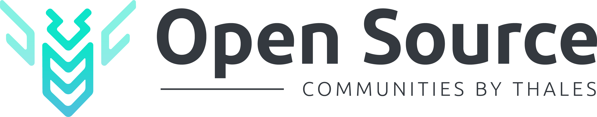

# Hi, I'm Quentin MICHAUD 👋

Welcome on my Thales GitHub account, where you will find all the contributions I made within the [Thales Open Source community](https://github.com/ThalesGroup). 

## 📡 Current Status :

- 💼 PhD student in cybersecurity at [Thales](https://www.thalesgroup.com/en).
- ☁️ Cloud and [Kubernetes](https://kubernetes.io/) passionate
- 🧑‍💻 See also my [personal GitHub account](https://github.com/mh4ckt3mh4ckt1c4s/).
- 🦊 I'm also on [GitLab](https://gitlab.com/mh4ckt3mh4ckt1c4s) 😎
- 💡 Loving to learn always more !

## 🚀 Skills

	<code></code>
	<code></code>
	<code></code>

## 📊 Stats

 

	

